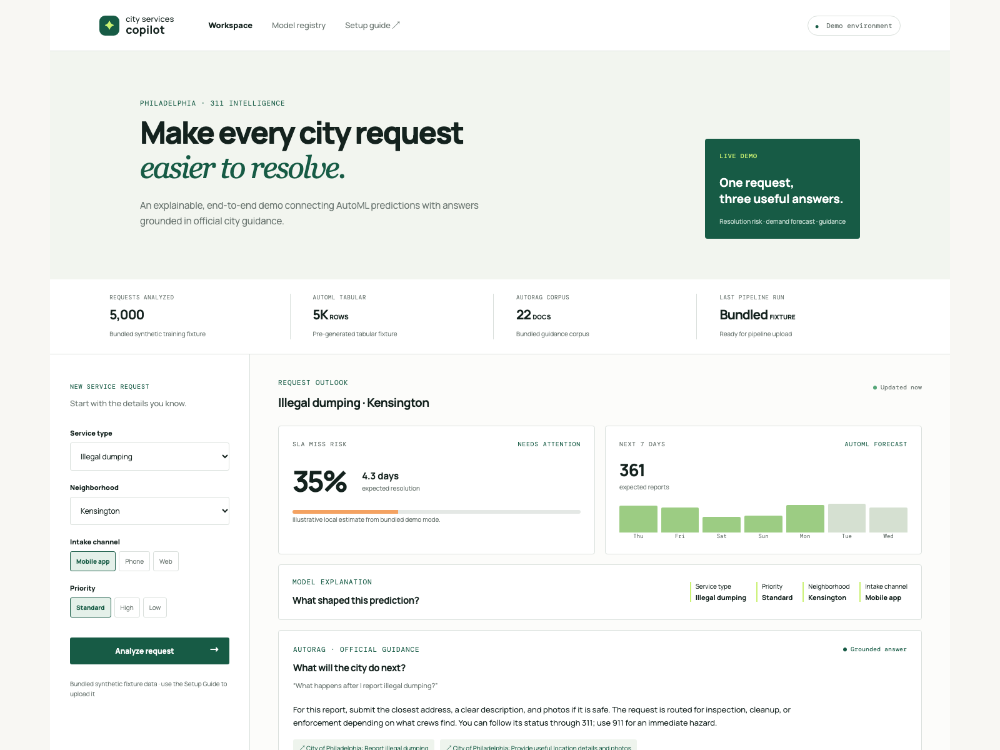

# City Services Copilot

An end-to-end city-services demo: AutoML predicts 311 resolution risk and demand, while AutoRAG answers service-policy questions using official city documents.

This is the single setup guide. Complete the sections in order.

## What the sample app looks like

The local sample mode presents a new 311 service request alongside its predicted SLA risk, seven-day demand forecast, model drivers, and source-grounded guidance answer.



## The use case: help 311 teams triage service requests

City service teams receive more requests than they can inspect or resolve at once. A supervisor needs to know which new requests are likely to miss their service target, how much work is approaching, and what the resident should expect next. Those answers usually live in separate places: an operations dataset, a forecasting process, and public service guidance.

This demo brings those views together around one representative scenario: a resident reports illegal dumping in a neighborhood. The operator selects the request details and receives:

- **Resolution-risk prediction:** a tabular AutoML model estimates the likelihood that the request misses its SLA and an expected resolution time.
- **Demand forecast:** an AutoML time-series model estimates the next seven days of reports for the selected service type.
- **Grounded next-step answer:** AutoRAG retrieves the relevant bundled 311 guidance and returns an answer with source links.

The bundled fixtures are synthetic and the sample-mode results are illustrative. The demo is designed to show the integration pattern—not to make operational decisions or represent live City of Philadelphia service levels. In a production deployment, replace the fixtures with approved, governed data; validate performance and fairness; and connect the app to the selected deployed model and RAG pattern.

> **Verified pipeline source:** [`opendatahub-io/pipelines-components`](https://github.com/opendatahub-io/pipelines-components) `main` at [`3a8f9a1`](https://github.com/opendatahub-io/pipelines-components/tree/3a8f9a1c25b06c58a30082eb28ba6d9a2295f14b), checked 2026-09-30. Dashboard labels can differ; use the parameter names below as the source of truth.

## Fast path: run the included demo

The repository already contains safe, synthetic fixture CSVs, a twenty-two-document AutoRAG guidance corpus, and evaluation data. For a first end-to-end run, do **not** download, transform, or prepare data.

After the one-time platform prerequisites are ready, the demo user only needs to:

1. Create their private environment file and install the runner dependencies:

   ```bash
   cp .env.example .env
   python3 -m pip install -r requirements-cluster.txt
   ```

   Fill `.env` with the cluster or KFP route and token, S3 connection, existing Kubernetes-secret names, MaaS/vector-database secret names, and model IDs. Set `RHOAI_KFP_URL` directly, or set `RHOAI_URL` and let the runner discover the existing `ds-pipeline` OpenShift Route in the project.

2. Review the planned upload and submissions, then execute them:

   ```bash
   python3 scripts/run_cluster_demo.py --dry-run
   python3 scripts/run_cluster_demo.py
   ```

3. Start the app with `python3 main.py`, then open `http://localhost:8000`.

The repository contains deterministic synthetic fixtures with 5,000 tabular rows, 7,300 time-series rows across all 20 service/neighborhood series, twenty-two guidance documents, and thirteen AutoRAG evaluation questions. The CSVs exceed the AutoML 1,000-record minimum and make a more realistic pipeline exercise. They are still not intended to produce credible quality metrics. Recreate the CSVs with `python3 scripts/generate_demo_fixtures.py` if needed.

### Guided setup

Prefer a prompt-driven flow? Run:

```bash
python3 scripts/setup_demo.py
```

After you create `.env` from `.env.example`, the wizard runs the same dry-run preflight, shows every upload and pipeline submission, and asks for confirmation before making changes. Use `--dry-run` to stop after the preview, or `--apply` for an unattended run. It never creates Kubernetes secrets or downloads external data.

### Automated cluster run

To upload the bundled fixtures and submit all three managed pipeline runs from one `.env` file, use the included cluster runner. Its KFP managed-pipeline lookup and bearer-token authentication follow the current [AutoX CI](https://github.com/red-hat-data-services/autox-ci) approach.

```bash
python3 -m pip install -r requirements-cluster.txt
cp .env.example .env
# Edit .env with the cluster, S3, Kubernetes-secret, MaaS, vector-database, and model values.
python3 scripts/run_cluster_demo.py --dry-run
python3 scripts/run_cluster_demo.py
```

The dry run validates the bundled data and configuration, then shows a compact submission plan—pipeline, S3 inputs, existing connection names, targets, and selected models—without writing to the cluster. Add `--show-parameters` only when troubleshooting and you need the full KFP parameter JSON. The normal command uploads the bundled synthetic CSVs, documents, and evaluation JSON; then submits the tabular AutoML, time-series AutoML, and AutoRAG managed pipelines. After submission in an interactive terminal, it asks whether to watch all runs. When successful tabular or time-series runs finish, it asks whether to deploy their selected models as KServe scoring endpoints; that deployment prompt defaults to **No**. Use `--wait` to start watching without the first prompt, `--non-interactive` for unattended submission, `--only tabular`, `--only timeseries`, or `--only autorag` to run one pipeline, and `--skip-upload` only after a successful upload.

### Monitor submitted runs and leaderboards

Use the submitted run IDs to check status without resubmitting anything:

```bash
python3 scripts/run_cluster_demo.py --status TABULAR_RUN_ID TIMESERIES_RUN_ID AUTORAG_RUN_ID --watch
```

The monitor prints each KFP run as a compact status block, followed by a ranked leaderboard table once it succeeds. During `--watch` in an interactive terminal, it prints each run link once and then uses one in-place spinner while it waits for the next poll, rather than repeating unchanged running states. Successful states and the best row are highlighted; redirected logs stay readable and print only state changes. It also prints any AutoML HTML leaderboard location and the AutoRAG pattern-artifact location. By default, artifact lookup uses `AWS_S3_BUCKET`; set `PIPELINE_ARTIFACTS_S3_BUCKET` and, if applicable, `PIPELINE_ARTIFACTS_S3_PREFIX` when pipeline artifacts are stored elsewhere. Artifact retrieval uses the same S3 credentials in `.env`.

### Deploy the selected AutoML models

After the tabular and time-series runs have succeeded, the runner can select each run's highest-scoring predictor artifact and create a persistent KServe `InferenceService` for it:

```bash
python3 scripts/run_cluster_demo.py --deploy TABULAR_RUN_ID TIMESERIES_RUN_ID --wait-deploy
```

Add `--dry-run` to inspect the chosen model and generated `InferenceService` manifest without creating anything; it only reads the model artifacts from object storage.

This is an explicit cluster write: it creates `city-services-tabular-<first-8-run-id>` and `city-services-timeseries-<first-8-run-id>` in `RHOAI_PROJECT_NAME`. The command reuses an existing KServe-compatible object-storage data connection (`AUTOML_KSERVE_STORAGE_KEY`, defaulting to `AUTOML_S3_SECRET_NAME`), its service account (default `<storage-key>-sa`), and `AUTOML_SERVING_RUNTIME_NAME`. The connection must have read access to the pipeline-artifact bucket, and the named serving runtime must already support AutoGluon. The script does not create or alter secrets, service accounts, serving runtimes, or Model Registry records.

When a deployed service becomes ready, the runner updates the Git-ignored `app-config.json` (or `DEMO_APP_CONFIG_PATH`) with its KServe v1 scoring URI and a per-endpoint copy of the existing `RHOAI_TOKEN`. It preserves any existing AutoRAG `responses` endpoint and its default `api_token`. The app recognizes `endpoint_protocol: "kserve-v1"`, converts the UI request into the AutoGluon training schema and KServe `instances` payload, and adapts the native prediction response back to the UI. Start `python3 main.py` after deployment to use those configured scoring services.

For the runs printed by the example submission, use one line to avoid shell line-continuation mistakes:

```bash
python3 scripts/run_cluster_demo.py --deploy 840dbfed-0526-4340-b1ee-c130fe73d3c5 59967b67-4d3b-4253-831b-065961aebadd --wait-deploy
```

If you need to remove these demo endpoints later, delete only the two named resources in the demo project:

```bash
oc delete inferenceservice city-services-tabular-840dbfed city-services-timeseries-59967b67 -n YOUR_PROJECT
```

The native AutoGluon KServe APIs return model-specific prediction payloads. Before enabling live mode in this app, place the small request/response adapter described in [Enable live mode](#enable-live-mode) in front of each endpoint so it implements the app's `/api/predict` and `/api/forecast` contracts.

The runner does **not** download public datasets or create/modify Kubernetes secrets. It can read OpenShift Routes when using `RHOAI_URL` discovery, but does not create a DSPA or a Route. Those connections and secret names must already exist in the project. `.env` is Git-ignored; do not share it or commit credentials.

Route discovery prints its target and fails after `RHOAI_OPENSHIFT_API_TIMEOUT_SECONDS` (20 seconds by default) with guidance to verify `RHOAI_URL`, token permissions, VPN/network access, or set `RHOAI_KFP_URL` directly.

## What this demo uses

| Outcome | Pipeline | App result |
| --- | --- | --- |
| Resolution risk | `autogluon-tabular-training-pipeline` | Probability of SLA miss and expected resolution time. |
| Demand forecast | `autogluon-timeseries-training-pipeline` | Next seven days of request volume. |
| Grounded guidance | `documents-rag-optimization-pipeline` | Answer with official-source links. |

## Setup order

1. [Prerequisites](#1-prerequisites)
2. [Upload the bundled fixtures and submit runs](#automated-cluster-run)
3. [Train AutoML models](#3-train-automl-models)
4. [Deploy the selected AutoML models](#deploy-the-selected-automl-models)
5. [Run AutoRAG](#4-run-autorag)
6. [Connect and launch the app](#5-connect-and-launch-the-app)
7. [Validate and hand off](#6-validate-and-hand-off)

## 1. Prerequisites

### Local machine

You need Python 3.9 or later and an available local port 8000. No Python packages are required for the sample UI.

### OpenShift AI project

Ask the platform administrator to confirm each item before data preparation:

- You have **Editor** access to the project.
- A pipeline server can run the managed AutoML and AutoRAG pipelines, or matching definitions have been imported. If using the dashboard, the AutoML and Gen AI/AutoRAG views are enabled.
- Compute quota supports the `speed` preset (4 vCPU, 16 GiB) and, if used, `balanced` (8 vCPU, 32 GiB).
- An AutoML S3 secret exists with `AWS_ACCESS_KEY_ID`, `AWS_SECRET_ACCESS_KEY`, `AWS_S3_ENDPOINT`, and `AWS_DEFAULT_REGION`.
- AutoRAG has S3 secrets for both test data and documents. Each needs `AWS_ACCESS_KEY_ID`, `AWS_SECRET_ACCESS_KEY`, and `AWS_S3_ENDPOINT`; region is optional.
- A MaaS secret exists with `MAAS_BASE_URL` and `MAAS_API_KEY`.
- A remote Milvus secret (`MILVUS_*`, minimum `MILVUS_URI`) or PGVector secret (`PGVECTOR_*`) exists. Inline vector databases are unsupported.
- You know at least one embedding-model ID and one generation-model ID exposed by MaaS. The AutoRAG pipeline requires explicit lists.

Record the project, secret *names*, bucket names, S3 prefix, MaaS secret, and database secret in a private handoff. Never commit secret values or send them to the browser.

**Continue only when:** required connections and secret names are available in the project.

## Bundled data layout

All inputs required for the demo are already in the repository:

```text
data/
├── prepared/
│   ├── resolution-risk.csv
│   └── service-demand-daily.csv
├── guidance/                    # current, official city documents
└── autorag-evaluation.json
```

Synthetic fixtures for `prepared/` and twenty-two guidance documents are already included, so validation and upload work immediately. The CSVs meet the 1,000-record AutoML minimum. The bundled guidance files are concise demo summaries with official-source links.

### Validate bundled data

```bash
python3 scripts/validate_demo_inputs.py
```

It verifies schema, UTF-8, non-empty files, evaluation JSON, and full S3 document keys.

### Upload to S3-compatible storage

Use the included uploader after configuring the AWS CLI with credentials that can write to the target bucket. It uploads the bundled prepared AutoML data, guidance documents, and evaluation JSON. It runs in dry-run mode by default:

```bash
scripts/upload_demo_data.sh \
  --bucket YOUR_BUCKET \
  --profile YOUR_AWS_PROFILE \
  --endpoint-url https://YOUR-S3-ENDPOINT
```

Review the listed destinations, then add `--apply` to perform the upload. Omit `--profile` for the AWS CLI default profile, and omit `--endpoint-url` when using AWS S3.

The uploader uses these exact object keys:

```text
city-services-copilot/automl/resolution-risk.csv
city-services-copilot/automl/service-demand-daily.csv
city-services-copilot/autorag/guidance/<official-guidance-files>
city-services-copilot/autorag/autorag-evaluation.json
```

**Continue only when:** the validator succeeds and all files are visible through the project connection.

## 3. Train AutoML models

Both pipelines ingest source data from S3, write internal split data on the pipeline workspace, and publish an HTML leaderboard plus refitted `_FULL` model artifacts.

### SLA-risk classification

Start `autogluon-tabular-training-pipeline` from the pipeline dashboard or KFP client.

| Parameter | Value |
| --- | --- |
| `train_data_secret_name` | AutoML S3 secret. |
| `train_data_bucket_name` | Prepared-data bucket. |
| `train_data_file_key` | `city-services-copilot/automl/resolution-risk.csv` |
| `label_column` | `sla_miss` |
| `task_type` | `binary` |
| `positive_class` | `1` for a 0/1 label, otherwise exact positive label. |
| `eval_metric` | Data-owner-approved metric. Empty defaults to `accuracy`. |
| `top_n` | `3` |
| `preset` | `speed` first; `balanced` after a successful baseline. |

Leave `test_data_bucket_name` and `test_data_file_key` empty for the pipeline's stratified holdout, or supply both for a fixed labeled test set.

Inspect the leaderboard, metrics, feature importance, confusion matrix, ROC/PR curves, and generated predictor notebook. Select a model only after checking recall at the operational alert threshold and errors by service type and neighborhood. Record its artifact:

```text
models_artifact/<ModelName>_FULL/predictor/
```

### Demand forecast

Start `autogluon-timeseries-training-pipeline` with the same S3 secret and bucket.

| Parameter | Value |
| --- | --- |
| `train_data_file_key` | `city-services-copilot/automl/service-demand-daily.csv` |
| `target` | `target` |
| `timestamp_column` | `timestamp` |
| `id_column` | `item_id` |
| `prediction_length` | `7` |
| `top_n` | `3` |
| `preset` | `speed` |

Leave `known_covariates_names` empty unless their values are known for every future day. Leave external test fields empty for the per-series temporal holdout. The default metric is `mean_absolute_scaled_error`. Inspect performance by service type and peak day, then record the selected `_FULL` artifact and notebook. Always use named parameters: `timestamp_column` precedes `id_column` in the current interface.

**Continue only when:** selected tabular and time-series `_FULL` model paths and performance evidence are recorded.

## 4. Run AutoRAG

AutoRAG supports PDF, DOCX, PPTX, Markdown, HTML, TXT, ODT, ODP, AsciiDoc, LaTeX, EPUB, and EML inputs.

Start `documents-rag-optimization-pipeline` from the pipeline dashboard or KFP client.

| Parameter | Value |
| --- | --- |
| `test_data_secret_name`, `test_data_bucket_name`, `test_data_key` | Evaluation S3 secret, bucket, and `city-services-copilot/autorag/autorag-evaluation.json`. |
| `input_data_secret_name`, `input_data_bucket_name` | Guidance-corpus S3 secret and bucket. |
| `input_data_keys` | `['city-services-copilot/autorag/guidance/']` |
| `maas_secret_name` | MaaS URL/API-key secret. |
| `db_secret_name` | Remote Milvus or PGVector secret. |
| `embedding_models` | Explicit list of embedding model IDs. |
| `generation_models` | Explicit list of generation model IDs. |
| `optimization_metric` | `unitxt:faithfulness` for first run. |
| `optimization_max_rag_patterns` | `5` (allowed range: `4`–`10`). |
| `preset` | `speed` for first run. |

`speed` supports Unitxt and custom metrics. Use `balanced` for table parsing, hybrid chunking, and LLM contextual enrichment; it additionally supports RAGAS metrics such as `ragas:context_precision`. `custom:overall_score` is also valid.

Inspect the HTML leaderboard, retrieval/citation quality, and answers to representative questions. Retain the selected pattern’s `pattern.json`, evaluation results, and generated notebooks. The current pipeline stores its response template at `pattern.json` → `settings.responses_template`; it does not produce the previous separate `v1_responses_body.json` artifact.

Run the selected indexing/inference notebooks in a workbench with the same S3, MaaS, and database connections. Re-index only after a corpus change.

**Continue only when:** the selected pattern answers evaluation questions with attributable corpus documents and its artifact location is recorded.

## 5. Connect and launch the app

### Run sample mode

```bash
python3 main.py
```

Open [http://localhost:8000](http://localhost:8000). Change a service type and click **Analyze request**; risk and forecast should update. Ask the default illegal-dumping question; two source links should appear. These are local sample results, so no cluster credentials are needed yet.

### Enable live mode

Deploy the selected tabular and time-series AutoML models as scoring endpoints. The application backend sends each new service-request payload to those endpoints at request time; it does not load model artifacts or score in the browser. Deploy the selected AutoRAG pattern behind an inference endpoint in the same way.

For this sample, the user only needs to provide an API key/token and the three endpoint URIs. Copy the template and fill in those values:

```bash
cp app-config.example.json app-config.json
```

`app-config.json` is ignored by Git and is read only by the Python backend. Start the app normally with `python3 main.py`; when an endpoint URI is configured, its matching route forwards the request to that endpoint with `Authorization: Bearer <api_token>`. The deployment runner creates or updates the tabular and time-series entries automatically after those KServe services are ready; add the AutoRAG `responses` entry separately. Omit the file to keep using local sample mode.

The `responses` URI is the deployed best AutoRAG pattern's OpenAI Responses-compatible REST endpoint. For every question, `/api/ask` sends `{"input": "<user question>"}` to that URI and renders the returned `output_text` plus any standard URL citations. No model name, MaaS setting, vector-database setting, or additional RAG configuration is required in the app.

For runner-configured `kserve-v1` endpoints, the Python backend performs the AutoGluon/KServe request and response adaptation. Other scoring endpoints must accept the JSON payload from their matching route and return the response contract below. Do not expose endpoints, tokens, MaaS, S3, or vector-database credentials to [app.js](app.js).

| Route | Source | Response contract |
| --- | --- | --- |
| `/api/predict` | Tabular AutoML scoring endpoint | `risk` (0–100), `days`, `band`, `drivers` |
| `/api/forecast` | Time-series AutoML scoring endpoint | Seven `{label, value}` points and `total` |
| `/api/ask` | Best AutoRAG pattern's Responses-compatible endpoint | `answer`, `sources` with `title`, `agency`, `url` |

Use the generated notebooks, endpoint contracts, and `pattern.json` as the source of truth for transformations, authentication, and inference calls. Preserve endpoint timeouts, request IDs, and safe error handling in the backend adapter. Do not label an answer “Grounded” without source metadata.

**Continue only when:** all three routes use live inference successfully.

## 6. Validate and hand off

Before presentation, verify:

- Classification uses only published features and returns a risk score.
- Forecast returns exactly seven future daily points for the selected service/neighborhood.
- Policy answers include at least one configured-corpus source.
- Out-of-corpus questions return a clear limitation, not fabricated policy.
- Changing service, neighborhood, priority, and channel changes live-adapter results.
- The final data version, run URLs, model/pattern IDs, acceptance metrics, and test questions are retained with the release.

Keep project/run URLs, artifact IDs, adapter URL, secret-manager location, data extraction date, preprocessing version, limitations, and fallback plan in a private deployment runbook. If the cluster is unavailable, use sample mode and clearly state that its results are illustrative.

### Troubleshooting

| Symptom | Check |
| --- | --- |
| AutoML cannot see a CSV | S3 secret, bucket/key, UTF-8/comma CSV, header row, permissions. |
| Classification metric is misleading | Class balance, temporal validation, precision/recall at alert threshold. |
| AutoRAG cannot find document keys | `correct_answer_document_keys` exactly match uploaded S3 object keys. |
| AutoRAG cannot start | Test-data S3, document S3, MaaS, Milvus/PGVector, embedding list, generation list. |
| UI still shows sample results | The backend adapter did not replace the three local `main.py` functions. |

## Repository map

| Path | Purpose |
| --- | --- |
| `main.py` | Local web server, sample-mode behavior, and server-side endpoint client. |
| `index.html`, `styles.css`, `app.js` | Interactive demo UI. |
| `app-config.example.json` | Copyable endpoint URI and API-token configuration template. |
| `data/README.md` | Local data-staging convention. |
| `data/autorag-evaluation.json` | Starter evaluation data. |
| `scripts/validate_demo_inputs.py` | Dependency-free data preflight validator. |
| `scripts/upload_demo_data.sh` | Validate and dry-run/upload prepared data to S3-compatible storage. |
| `scripts/setup_demo.py` | Interactive confirmation and preflight for the `.env` cluster runner. |
| `scripts/run_cluster_demo.py` | Non-interactive `.env` upload and managed-pipeline submission runner. |
| `scripts/generate_demo_fixtures.py` | Regenerate the deterministic synthetic AutoML fixture CSVs. |
| `.env.example`, `requirements-cluster.txt` | Cluster-runner configuration template and its Python dependencies. |
